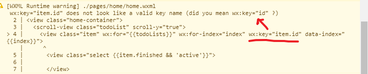
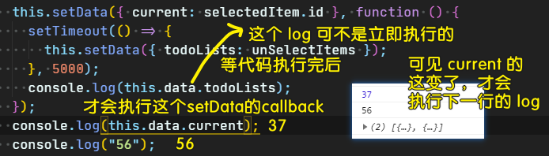

### ✍️ Tangxt ⏳ 2020-10-17 🏷️ 首页

# 02-首页制作

## ★前言

拿到设计稿 -> 分析需求 -> 开始首页制作

## ★全局 button 组件

代码：[Demo](https://github.com/ppambler/vue-morney/commit/9897cef31e23ec815af2cdbb49112a8c6060a620)

💡：如何自定义一个组件？

文档：[自定义组件](https://developers.weixin.qq.com/miniprogram/dev/framework/custom-component/)

简单来说，就是像写页面一样，去写一个组件！

写一个组件的步骤是这样的：

1. 用小程序 IDE 新建一个组件
2. 局部声明：如果要在某个页面使用某个组件，那么你就得在该页面的`json`里边的`usingComponents`字段了，添加这个` "t-button":"/components/button/button"` -> 路径可以是相对的`../`，也可以是直接相对于根目录的`/`
3. 全局声明：在`app.json`里边的`usingComponents`字段里添加组件名和组件路径就好了 -> 这个可能会有 bug！

一些需要注意的细节：

- 组件的样式用 **`class`**，而不是`id`选择器、属性选择器、标签名选择器
- XML 节点标签名只能是**小写字母、中划线和下划线**的组合，所以自定义组件的标签名也得这样！
- **自定义组件也是可以引用自定义组件的**，引用方法类似于页面引用自定义组件的方式（使用 usingComponents 字段）
- 自定义组件和页面所在项目根目录名**不能以“wx-”为前缀**，否则会报错

为什么我们要自定义去组件？

> 开发者可以将页面内的功能模块抽象成自定义组件，以便**在不同的页面中重复使用**；也可以将复杂的页面拆分成多个低耦合的模块，有助于代码维护。自定义组件在使用时与基础组件非常相似

➹：[微信小程序-快速完成一个自定义组件 - 简书](https://www.jianshu.com/p/54b46efad151)

➹：[新增的自定义组件的路径是绝对路径还是相对路径？- 微信开放社区](https://developers.weixin.qq.com/community/develop/doc/9b729a8ff2ced8d05b3cde696fea3305)

➹：[小程序 app.json 中加入 usingComponents 问题 - 微信开放社区](https://developers.weixin.qq.com/community/develop/doc/000a40abe1c2b0e19f789c7af51c00)

💡：一个底部导航栏怎么定义？

💡：样式处理？

> `class`的值，千万不要因为值过长，而用个回车换行它哈！不然，会报错！

一个组件如何呈现？这得看用户传了什么样的属性值：

`t-button`的 API:

- type：默认值`'defalut'`
- size：默认值`''`

## ★全局 clock 组件

代码：[Demo](https://github.com/ppambler/vue-morney/commit/f38c1d2a981f53695b2739025b65bcc2303025e7)

💡：`view`组件？

[view - 微信开放文档](https://developers.weixin.qq.com/miniprogram/dev/component/view.html)

## ★全局 confirm 组件

代码：[Demo](https://github.com/ppambler/vue-morney/commit/f81a577083974b939b52a1cbebc6ef0f825a9e7d)

组件的状态变化了，你要`setData({xxx: 新值})`一下，页面才会响应式更新！

注意：访问组件的状态要用`thid.data.xxx`，这个`data`是不可省略的，而 Vue 则是可以省略的！

数组是可以用`push`方法的！

💡：遮罩层怎么做？

➹：[css 遮罩层怎么做？ - html 中文网](https://www.html.cn/qa/css3/13011.html)

💡：`wx:key="item.id"`警告？

可直接简写成：`wx:key="id"`

➹：[wx:key 报错 does not look like a valid key name？ - 微信开放社区](https://developers.weixin.qq.com/community/develop/doc/000600fb83c158c1e26999fa951400)

💡：事件的绑定？

bindtap：触摸元素之后离开就触发事件 -> 类似于点击事件

我们使用自定义组件时要触发自定义事件，需要自定义组件内部的元素向往抛一个自定义事件名出来！

## ★todo 增删改查模拟

[scroll-view - 微信开放文档](https://developers.weixin.qq.com/miniprogram/dev/component/scroll-view.html)

💡：`text`标签无法文字垂直居中？

于是我把其改成是`view`标签了！

💡：CSS 多行文本溢出？

➹：[CSS 多行文本溢出省略显示 - 前端](https://juejin.im/entry/6844903461209767944)

➹：[小程序开发单行多行文本溢出省略号显示 - 云+社区 - 腾讯云](https://cloud.tencent.com/developer/article/1489800)

💡：`item`被选中的样式？

代码：[Demo](https://github.com/ppambler/vue-morney/commit/72a0f7c503988f712c65dc7a7915a491bedd5a1b)

💡：一条 todo 被选中了，那么意味着它要被移除，那么其中的移除动画怎么弄？

💡：本地存储怎么弄？

➹：[微信小程序--本地存储 - 简书](https://www.jianshu.com/p/6b6d7617b222)

➹：[wx.getStorage(Object object) - 微信开放文档](https://developers.weixin.qq.com/miniprogram/dev/api/storage/wx.getStorage.html)

➹：[小程序数据本地存储？ - 微信开放社区](https://developers.weixin.qq.com/community/develop/doc/000668825848506f2f3991a7b56800)

💡：小程序的日期处理？

➹：[微信小程序获取系统日期和时间及时间戳 - 简书](https://www.jianshu.com/p/42670f94744c)

💡：如何获取被点击的元素对象？

➹：[如何获取被点击对象的元素 - 微信开放社区](https://developers.weixin.qq.com/community/develop/doc/000e20c1a8c8086a28470f9455b800?_at=1563331637271)

💡：`animate.css`的使用？

在小程序里边你使用第三方动画库，那么你需要拷贝它的样式表，然后把这个样式`import`到全局的`app.wxss`里边 -> 测试一下这个动画库是否能正常工作

找到一个`view`元素：

1. 添加`animated`类 -> 这是必须添加的
2. `fadeIn` -> 元素在页面渲染后（也许是完成这个渲染的过程）就会搞这个动画
3. `fadeOut` -> 元素在页面消失前就会搞这个动画

➹：[微信小程序开发-76种动画 animate.css - 微信开放社区](https://developers.weixin.qq.com/community/develop/doc/00024648e982c0819e97ac85c5b804)

➹：[Animation - 微信开放文档](https://developers.weixin.qq.com/miniprogram/dev/api/ui/animation/wx.createAnimation.html)

➹：[animate.css的使用 - 小火柴的蓝色理想 - 博客园](https://www.cnblogs.com/xiaohuochai/p/7372665.html)

➹：[Animate.css - A cross-browser library of CSS animations.](https://animate.style/)

➹：[CSS3动画animation认识，animate.css的使用](https://juejin.im/post/6844903864496291853)

💡：`setData`的异步或同步？

等所有的 `data` 值改变之后（同步操作），在进行统一渲染（异步操作）

➹：[微信小程序之setData是异步执行的吗 - 简书](https://www.jianshu.com/p/fec21def9006)

➹：[this.setData是异步还是同步? - 微信开放社区](https://developers.weixin.qq.com/community/develop/doc/a197807745119ea9b03a27e6602ce920)

➹：[微信小程序中关于setData()函数的异步同步概念的解释_magicdoger的博客-CSDN博客](https://blog.csdn.net/magicdoger/article/details/81347062)

➹：[小程序SetData同步还是异步问题_景色分明-CSDN博客](https://blog.csdn.net/qq_31325079/article/details/81044866)