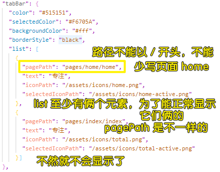
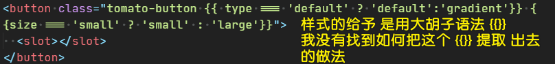
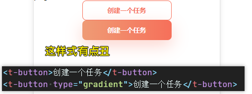
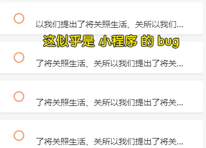

### ✍️ Tangxt ⏳ 2020-10-17 🏷️ 首页

# 02-首页制作

## ★前言

拿到设计稿 -> 分析需求 -> 开始首页制作

## ★全局 button 组件

代码：[Demo](https://github.com/ppambler/vue-morney/commit/9897cef31e23ec815af2cdbb49112a8c6060a620)

💡：如何自定义一个组件？

文档：[自定义组件](https://developers.weixin.qq.com/miniprogram/dev/framework/custom-component/)

简单来说，就是像写页面一样，去写一个组件！

写一个组件的步骤是这样的：

1. 用小程序 IDE 新建一个组件
2. 局部声明：如果要在某个页面使用某个组件，那么你就得在该页面的`json`里边的`usingComponents`字段了，添加这个` "t-button":"/components/button/button"` -> 路径可以是相对的`../`，也可以是直接相对于根目录的`/`
3. 全局声明：在`app.json`里边的`usingComponents`字段里添加组件名和组件路径就好了 -> 这个可能会有 bug！

一些需要注意的细节：

- 组件的样式用 **`class`**，而不是`id`选择器、属性选择器、标签名选择器
- XML 节点标签名只能是**小写字母、中划线和下划线**的组合，所以自定义组件的标签名也得这样！
- **自定义组件也是可以引用自定义组件的**，引用方法类似于页面引用自定义组件的方式（使用 usingComponents 字段）
- 自定义组件和页面所在项目根目录名**不能以“wx-”为前缀**，否则会报错

为什么我们要自定义去组件？

> 开发者可以将页面内的功能模块抽象成自定义组件，以便**在不同的页面中重复使用**；也可以将复杂的页面拆分成多个低耦合的模块，有助于代码维护。自定义组件在使用时与基础组件非常相似

➹：[微信小程序-快速完成一个自定义组件 - 简书](https://www.jianshu.com/p/54b46efad151)

➹：[新增的自定义组件的路径是绝对路径还是相对路径? - 微信开放社区](https://developers.weixin.qq.com/community/develop/doc/9b729a8ff2ced8d05b3cde696fea3305)

➹：[小程序app.json中加入usingComponents问题 - 微信开放社区](https://developers.weixin.qq.com/community/develop/doc/000a40abe1c2b0e19f789c7af51c00)

💡：一个底部导航栏怎么定义？

💡：样式处理？

> `class`的值，千万不要因为值过长，而用个回车换行它哈！不然，会报错！

一个组件如何呈现？这得看用户传了什么样的属性值：

`t-button`的API:

- type：默认值`'defalut'`
- size：默认值`''`

## ★全局 clock 组件

代码：[Demo](https://github.com/ppambler/vue-morney/commit/f38c1d2a981f53695b2739025b65bcc2303025e7)

💡：`view`组件？

[view - 微信开放文档](https://developers.weixin.qq.com/miniprogram/dev/component/view.html)

## ★全局 confirm 组件

代码：[Demo](https://github.com/ppambler/vue-morney/commit/f81a577083974b939b52a1cbebc6ef0f825a9e7d)

💡：事件的绑定？

bindtap：触摸元素之后离开就触发事件 -> 类似于点击事件

我们使用自定义组件时要触发自定义事件，需要自定义组件内部的元素向往抛一个自定义事件名出来！

## ★todo 增删改查模拟

[scroll-view - 微信开放文档](https://developers.weixin.qq.com/miniprogram/dev/component/scroll-view.html)

💡：`text`标签无法文字垂直居中？

于是我把其改成是`view`标签了！

💡：CSS 多行文本溢出？

➹：[CSS 多行文本溢出省略显示 - 前端](https://juejin.im/entry/6844903461209767944)

➹：[小程序开发单行多行文本溢出省略号显示 - 云+社区 - 腾讯云](https://cloud.tencent.com/developer/article/1489800)

💡：`item`被选中的样式？

代码：[Demo](https://github.com/ppambler/vue-morney/commit/72a0f7c503988f712c65dc7a7915a491bedd5a1b)