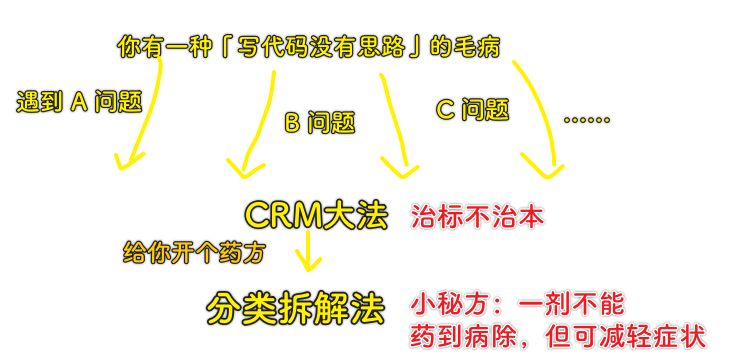
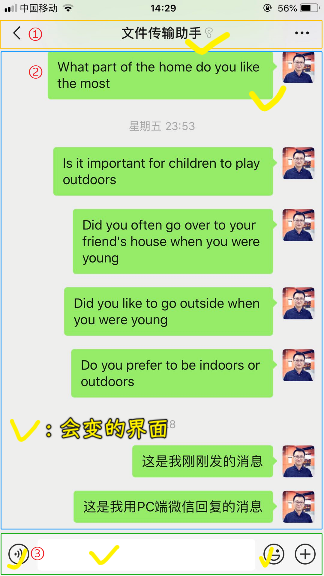
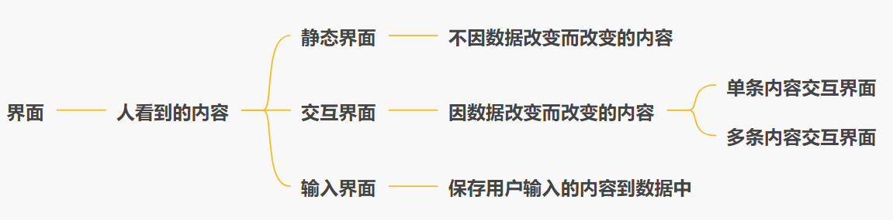
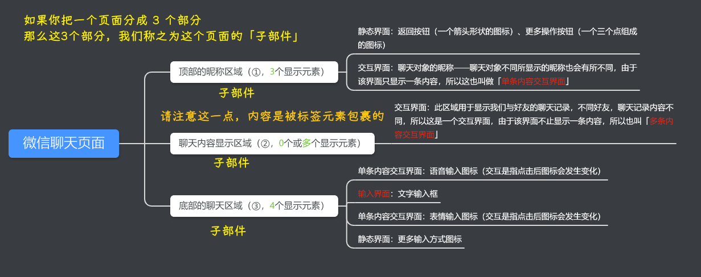
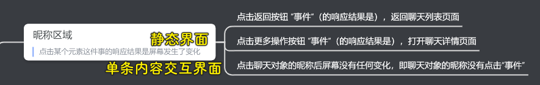
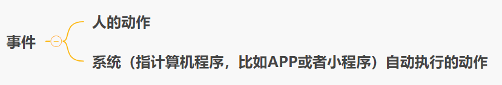
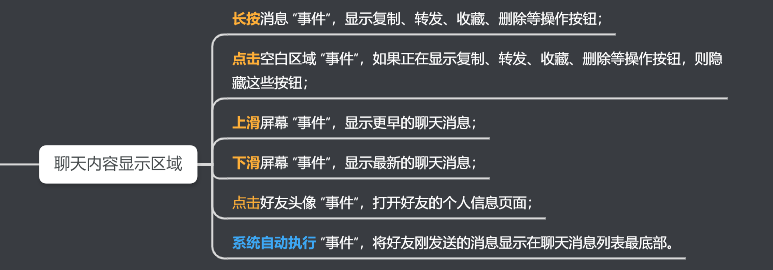
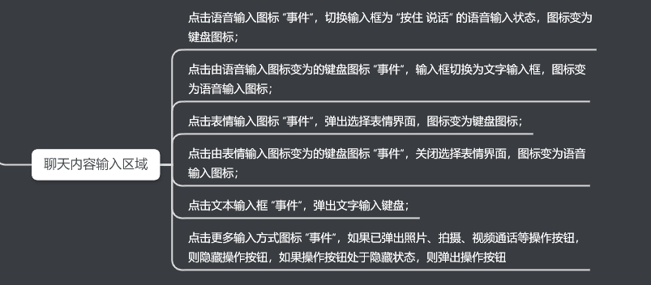
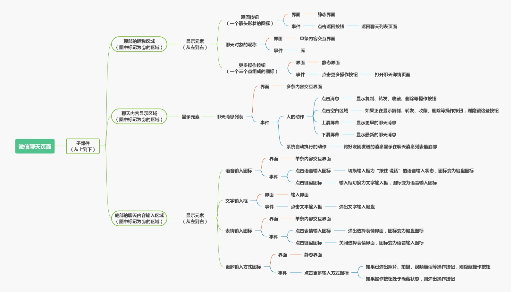

### ✍️ Tangxt ⏳ 2020-12-17 🏷️ 开篇

# 开篇

## ★01 开篇词：为什么你觉得学编程好难？

1）我真得没有思路

一个有趣的现象：

> 在与同事共事的过程中，A 同事**一点就透**，甚至无师自通，而 B 同事则在代码评审被打回修改**多次**后，却总还是提交让人难以理解和 Bug 遍野的代码。.....

可以看到 B 同事**编写代码的效率和质量**是有问题的……

那如何解决之呢？让大佬：

- 定期组织内部学习高质量源代码，期望达到 "读码百遍其义自见的效果"
- 建立各种高度封装的开发框架，尽量减少程序代码编写量，毕竟少写少错对吧
- ……

然而并没有什么卵用……B 同事写出来的代码依旧辣鸡！

直到有一天，有一妹子说到「他们也想写出优雅的代码，可**在编程的时候就是咩有清晰的思路**」

他们一般写代码的姿势是「搜索编程大法」，也就是「CRM」大法 -> 找到别人解决这个问题的代码，复制之，运行之，改之，得到正确的运行结果，这段代码就 OK 了！

2）如何解决没有思路的问题？

请使用编程思路梳理方法 “**分类拆解法**”，此方法效果不错，尤其对于前端新人来说！

3）该专栏最有价值的两个点

1. 分类拆解法
2. 实战商业项目「会员制社交电商小程序」，包括：
   * 如何一步一步完成整个项目的设计、开发、上线；
   * 如何使用这个实战项目作为你的小程序和 GitHub 作品，增加你的面试竞争力；
   * 当然还包括可以直接用于商业用途的完整源代码

4）小结

如果把「没有思路」类比成一种病的话，那么这可以是一种慢性疾病，它一直影响着你，但是「分类拆解法」可以慢慢调和你的病，直到康复……而不是当你病发时，你直接吃一颗治标不治本的药，表面上看，咩有困扰了，不痛了，但第二天，还是会触发……

就像是慢性胃炎那样……

总之，整个专栏内容都是以 “分类拆解法” 为**基础方法论**的，整个实战项目内容也是**完全按照分类拆解法来一步一步实现**的

> 你往树上摘果子，那么脚下的凳子就是你的底盘，底盘越高越稳，你就越能摘到又大又好吃的果子……而不是猴急，先把能摘到的吃了再说……

---

一些言论：

- 「搜索编程大法」的存在是为了让我们省事，让我们更快地完成 leader 交代下来的任务
- 迈过「搜索编程大法」是必经之路
- 「分类拆解法」的由来：是作者系统复盘总结，最终归纳出自己的一套方法论 -> 在编程道路上，你需要不断优化自身的方法，不断地迭代出适合自己的新方法…… -> 这个过程本身，也是一种方法，名为「迭代法」
- 后端使用云开发，有后端基础的同学也可以按照课程内容用其他语言实现
- **编程语言很易学，编程思想很难精，内外兼修方是正途**。 一朝悟道后，犹习得独孤九剑万法皆可破，任何编程语言都一学就会。 如果兄台已达此悟道之境，我必须要说一声：大神，这个专栏对你来说就是一门基础课
- 实战商业项目脱敏后的内容为主，**编程思维和用好小程序官方文档很重要**
- 专栏的“分类拆解法”可以帮助你理清编写代码的思路，思路清楚以后，只需要找到**实现这个思路的组件或小程序语法示例**即可一步步完成代码编写

## ★02 分类拆解法简介： 助你马上起飞的编程方法论

实验对象（微信聊天页面）：

1）界面分析

概念：

- 不会改变**显示内容**的元素叫做 “**静态界面**”
- 会改变显示内容的元素叫做 “**交互界面**”

> 以前的认识：看到一个页面不好看，就说界面不好看，其实准确来说应该是页面不好看才对。通常我们说界面不好看，这指的其实是软件界面不好看。我第一次认识到可以把一小部分内容也看作是一个界面……一点疑惑：说「输入界面」还是说「表单界面」好呢？……
> 
> 界面不单只是一个元素的界面，也可以是多个元素构成的界面，反正多个元素是同一类型的我们都可以整体说这是一个界面……那个顶部区域，我们整体来看似乎可以说是顶部区域界面，但这并不好，因为这划分的不够细呀……毕竟，这 3 个元素有着不一样的功能……

界面分析：

分析完后，你会发现这样一个问题：

> 界面其实都应该是静态的才对，因为那些所谓的「交互界面」是由于我们点击了它或者其它姿势才促使了显示内容的变化啊！

而这就引出了我们的下一个话题了：「**事件分析**」

我们在屏幕上对着页面指指点点的这种行为，或者说人的动作，定义为「**事件**」，说白了，就是你对这个页面指点江山，搞事情呀！而页面中的**界面部分**会因此发生某种反应（跳到某个界面、元素内容改变等）来响应你的行为……

2）事件分析

1、昵称区域

2、聊天内容显示区域

我们观察到的现象：

在聊天内容显示区域，我们长按一条消息，会出现复制、转发、收藏、删除等操作按钮，并且当我们此时点击空白区域，刚出现的这些操作按钮会消失掉；我们上下滑动屏幕，会显示更早或最新的聊天消息；我们点击好友头像，会打开好友的个人信息页面。

除此之外，当好友向我们发送消息，**系统**（系统是指**人编写的计算机程序**，比如 App 或者小程序。为什么要特指人？你见过动物写代码的吗，嘿嘿）会**自动**将好友刚发送的消息显示在聊天内容显示区域。

从中我们可以看到：

**“事件” 分为两类，人的动作和系统自动执行的动作**

因此，聊天内容显示区域的事件包括：

3、聊天内容输入区域

我们观察到的现象：

底部的聊天内容输入区域，我们点击语音输入图标，输入框会切换为 “按住 说话” 的语音输入状态，并且图标会变为键盘图标。当我们点击键盘图标，输入框会切换为文字输入框，并且图标会再次变回语音输入图标。

我们点击表情输入图标，会弹出选择表情的界面，并且图标会变为键盘图标。当我们点击键盘图标，选择表情界面会关闭，并且图标会再次变回表情输入图标。

我们点击文本输入框，会弹出文字输入键盘。

我们点击更多输入方式图标，会弹出照片、拍摄、视频通话等操作按钮，再次点击该图标，则会隐藏这些操作按钮。

所以，聊天内容输入区域包括以下事件：

以上**只列举了微信聊天页面的一部分内容**，还有其它一些动作，如点击语音消息、发送语音等就不一一列举了，同学们可以自己总结一下还有哪些 “界面” 和 “事件”。

> 动作，即人或系统对页面搞的动作，如人对页面有触摸动作，滑动动作等，而系统对页面有定时动作等……
> 
> 输入框有内容，会把「更多输入方式图标」搞成是「发送」按钮……疑问 -> 这还是静态界面吗？ -> 或许我们考量这个界面的标准是其内容是否发生了变化，而不是把一个元素搞成是另一个元素……

3）分析结果

总结一下微信聊天页面分析结果：

> 页面包含子部件，子部件包含三大区域？为啥不应该是一个子部件等于一大区域呢？ -> 或许作者的本意是这样的，子部件上，子部件中，子部件下这样……

通过上述分析过程（上图从左到右的过程），我们就可以相对轻松的**把一个很难靠脑袋想清楚的复杂功能（一个面），分类、拆解为多个我们可以清晰思考的多个小功能点（多个点）**。

> 分为三大类，拆解成各种小界面？还是把显示内容分为静态界面、交互界面、输入界面这三大类，然后再去拆解其中的事件？

如此一来，我们在编程的时候就可以一次**聚焦实现一个小功能点**。在一个个小功能点实现后，再把它们像**搭积木**一样组合起来（把一个个点按图**从右到左**进行拼装），就可以相对简单地完成整个复杂功能的代码编写。

并且，**一次聚焦思考一个点该怎么实现，我们更容易想得更全面。同样的编程水平，以这样的思路编写出来的代码，BUG 会更少，代码质量会更高**。

4）分类拆解法简介