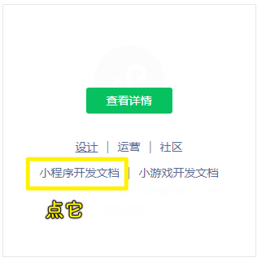
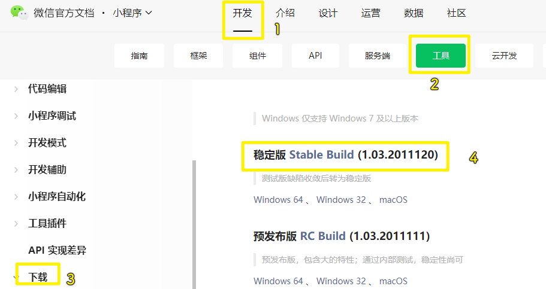
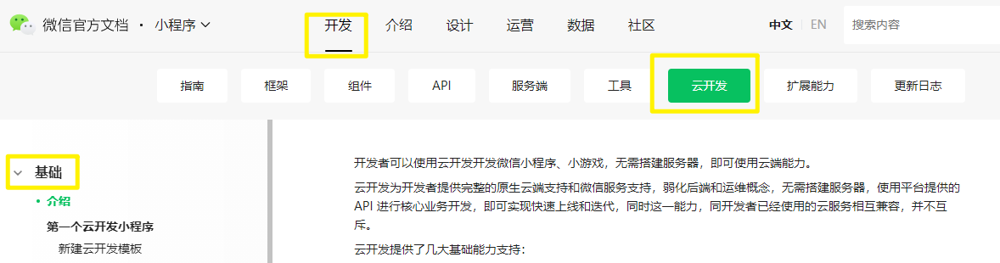
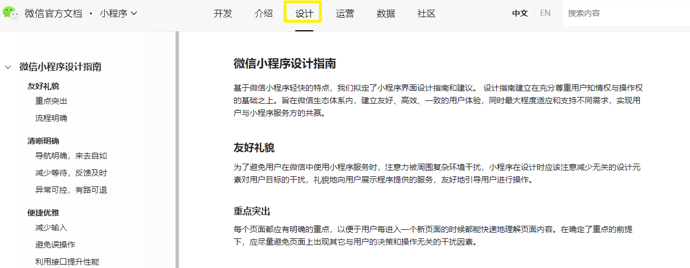

### ✍️ Tangxt ⏳ 2020-12-19 🏷️ 开发准备

# 02-小程序开发准备

## ★04 开发环境准备：屠龙勇者得有把好武器

> 没有智慧的头脑，就像没有蜡烛的灯笼。——托尔斯泰

1）微信小程序官方提供的免费资源

微信小程序官方开发文档（免费的）、微信开发者工具（免费的）、微信云开发（还是免费的）等

我们**不需要自己购买域名、购买服务器、域名网站备案**，也不需要因为自己没有公司实体，不得不去到处寻找反向代理的实现方法

据了解：**复杂的开发前置准备工作**，会搞晕 80% 的新人，几乎 100% 的初学者都无法完成这一系列及其复杂的操作

2）小程序开发环境组成

整个专栏的所有内容，**只需要“微信开发者工具”这一个 IDE 就可以完整实践**，并开发出你自己的小程序应用。

小程序开发环境具体来说分为三块：

* 小程序手机端应用，使用“**微信开发者工具**”的基础能力进行开发；
* 小程序服务器端应用，使用微信平台提供的“**微信云开发**”能力进行开发，它的开发环境也集成在了“微信开发者工具”中。使用“微信云开发”不需要自己搭建域名、应用服务器，也不需要自己搭建数据库服务器和图片服务器；
* 小程序开发手册，使用微信官方的“小程序开发文档”。它相当于我们学习英语时的牛津字典，有最权威、最全面的小程序开发说明。**碰到任何问题请不要度娘，请到这本“字典”中找答案**。 否则被各种搜索结果坑了，后果请自负哟。

3）特别提示

1. **学会如何在几十万字的文档中找到自己需要的内容（这就是使用微信官方“小程序开发文档”的方法）**，而不是把官方已经很完善的内容再用自己语言翻译一遍，毕竟这非常没有价值，也没有任何生产效率
2. 在本专栏中，提及到微信官方文档内容的部分，都会给出文档内容的具体位置。此时，**请暂时停止阅读本专栏内容，转而阅读微信官方文档的内容，阅读完之后再回到本专栏继续阅读**

4）小程序开发文档

💡：如何找到小程序开发文档？

有两种进入方式：

入口网址：[微信开放文档](https://developers.weixin.qq.com/miniprogram/dev/framework/)

> 里面包括了非常丰富的小程序开发、设计、运营等内容，没事多去逛逛总没错的。在社区中可以提自己碰到的各种开发问题，说不定就有热心人来帮你解决问题。右上角还提供了搜索功能，碰到问题可以尝试搜索寻找相关内容。

入口位置：[微信公众平台](https://mp.weixin.qq.com/)

5）微信开发者工具

💡：如何下载这个工具？

其下载地址有两种进入方式：

入口网址：[稳定版 Stable Build - 微信开放文档](https://developers.weixin.qq.com/miniprogram/dev/devtools/download.html)

入口位置：

打开 [微信开放文档](https://developers.weixin.qq.com/miniprogram/dev/framework/)，点几下：

请下载并安装稳定版。

在下载页面左侧的“界面”和“设置”等菜单中有微信开发者工具的详细使用说明文档，请仔细阅读。

6）云开发账号注册

小程序的云开发功能可以让我们在没有自己的域名、服务器、数据库等基础硬件环境时也可以开发一个完整的小程序服务器端应用。

使用云开发功能，我们必须要注册一个小程序账号，以下为小程序账号的注册方法。

1. 打开 [微信公众平台首页](https://mp.weixin.qq.com/)，点击右上角的立即注册按钮
2. 在注册账号类型中选择小程序
3. 使用邮箱注册账号，并填写一些基本信息。具体的注册操作在“小程序开发文档”中也有一篇“小程序接入指南”进行专门的详细讲解
4. 注册主体信息请选择个人，以确保你能完成账号注册。

“小程序接入指南”的入口位置如下：

- 入口网址：[产品定位及功能介绍 - 微信开放文档](https://developers.weixin.qq.com/miniprogram/introduction/)，如果该网址 GG 了，请用「入口位置」姿势
- 入口位置：打开小程序开发文档首页 -> 选择「介绍菜单」，会看到一个「小程序接入指南」的绿色按钮

7）下节预告

分析“微信开发者工具”自带的 Demo 程序，搞清楚小程序的源代码结构。

8）实践环节

本节实操内容：

- 打开微信开发者工具，按照微信开发者工具下载页面左侧的使用说明书，逐一熟悉工具的各项**基本功能**。
- 阅读"云开发"的“**基础**”章节的内容，了解云开发的基本概念与能力。

小程序「云开发」的基础章节的入口网址：[微信开放文档](https://developers.weixin.qq.com/miniprogram/dev/wxcloud/basis/getting-started.html)

把“微信小程序开发文档”的各个板块都打开看一遍，**了解其中包含了哪些丰富的内容**。

建议学有余力的同学阅读“微信小程序设计指南”，了解微信官方对**小程序界面美与丑的定义**，避免自己造出一个长得像“恐龙”小程序。

微信小程序设计指南入口位置：[微信小程序设计指南 - 微信开放文档](https://developers.weixin.qq.com/miniprogram/design/)

## ★05 源代码：了解构造才能下刀如有神

