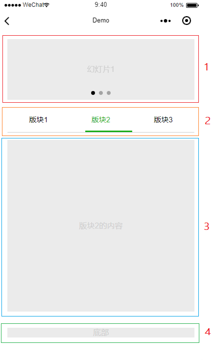
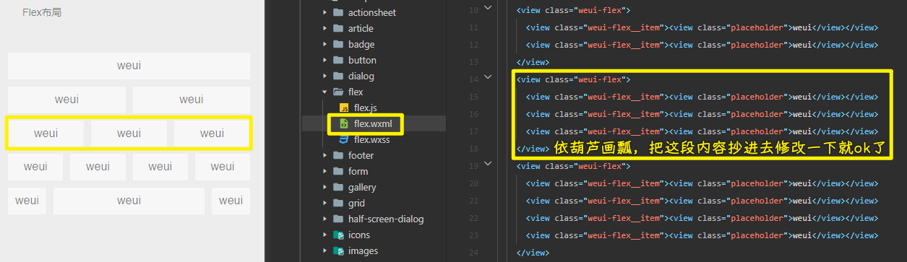
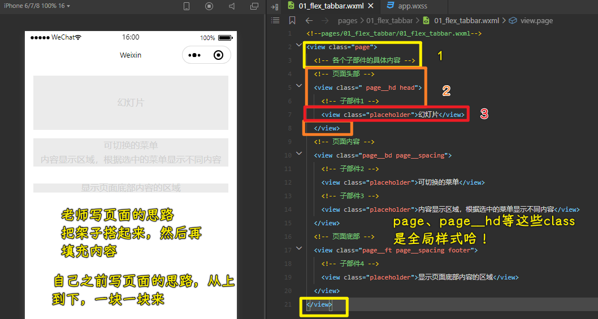
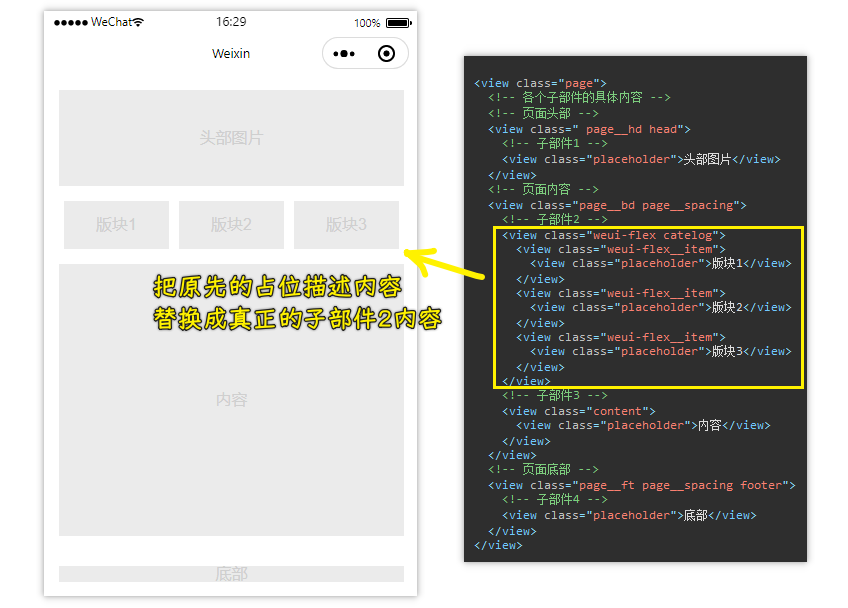
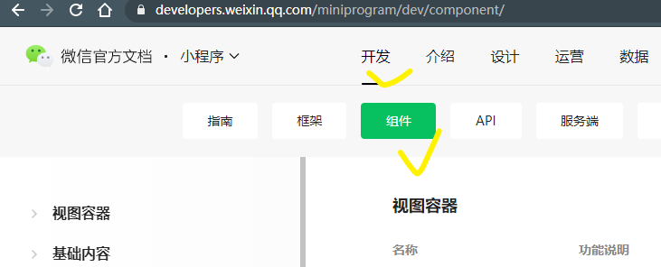
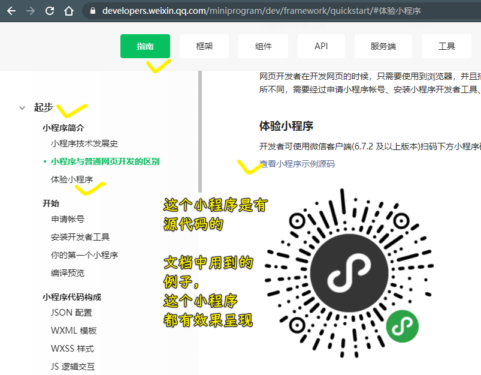
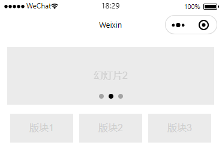
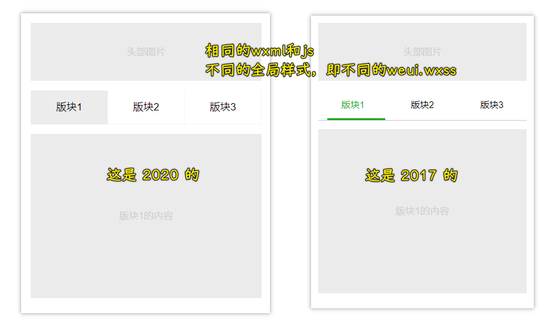

### ✍️ Tangxt ⏳ 2020-12-20 🏷️ 开发基础

# 小程序开发基础

在上一章我们已经安装好了微信开发者工具，也学习了 “分类拆解法” 的小程序编程思维。

本章我们将通过实践的方式来进一步理解 “分类拆解法”，同时掌握组件、WeUI 框架、云开发等小程序开发常用特性。

## ★07 页面布局：使用组件让页面开发如此简单

> 我们活着不能与草木同腐，不能醉生梦死，枉度人生，要有所作为。——方志敏

本节我们将实现如图 1 所示的页面 Demo。

图 1 页面布局与组件 Demo：



### <mark>1）拆解</mark>

开发页面之前，我们需要按照“分类拆解法”的拆解步骤对页面进行拆解。

#### <mark>1、页面拆解为子部件</mark>

拆解步骤的第一步是将页面拆解为多个子部件。

拆解出的子部件有 4 个，在图 1 中已用红色数字标出。

- 子部件 1 是一个幻灯片；
- 子部件 2 是一个可切换的菜单；
- 子部件 3 是一个内容显示区域，根据选中的菜单显示不同内容；- 是显示页面底部内容的区域。

**4 个子部件之间是上下排列的关系**。

#### <mark>2、子部件拆解为显示元素</mark>

每个子部件需要继续拆解为多个显示元素。

子部件 1 是一个幻灯片，我们从图中看到有 3 个点，这是一个显示元素。同时，3 个点表示幻灯片有 3 张，即 3 个显示元素。因此，子部件 1 一共有 4 个显示元素：

* 显示幻灯片张数的点
* 幻灯片 1
* 幻灯片 2
* 幻灯片 3

子部件 2 是一组菜单，一共有 3 个，即 3 个显示元素：

* 板块 1 菜单
* 板块 2 菜单
* 板块 3 菜单

子部件 3 是显示子部件 2 中选中菜单的内容，隐藏未选中菜单的内容。因此也有 3 个显示元素：

* 板块 1 内容
* 板块 2 内容
* 板块 3 内容

子部件 4 是显示页面底部内容的区域，在图 1 中底部内容应该是固定的，因此只有一个显示元素：

- 底部内容

#### <mark>3、显示元素拆解为分类</mark>

每个显示元素需要继续拆解为多个分类（界面、数据、事件）。

**子部件 1 的显示元素：**

  显示幻灯片张数的点

  根据我们使用各类 APP 和小程序的经验，显示幻灯片张数的点会根据当前播放的幻灯片变化，因此它是一个**交互界面**。

  同时，还需要有一个数据 `activeSlide` 来决定点如何显示，`activeSlide` 代表当前播放的幻灯片是哪一张。

  幻灯片 1、幻灯片 2、幻灯片 3

  三个幻灯片显示元素只会**同时显示一张在页面中**，有两张处在隐藏状态，因此它们都是**交互界面**。

  同时，它们也需要根据数据 activeSlide 来决定自己是显示还是隐藏。

  此外，根据我们的经验，当我们左右滑动屏幕，将切换显示不同的幻灯片。这即是说这里有一个**滑动事件**，该事件会根据人滑动屏幕改变数据 `activeSlide` ，来实现幻灯片切换。

**子部件 2 的显示元素：**

  板块 1 菜单、板块 2 菜单、板块 3 菜单

  三个菜单会有**选中、未选中**的状态切换，因此它们都是**交互界面**。

  同时，需要一个数据 `activeIndex` 来决定哪个菜单处于选中状态。

  此外，每个菜单还应该有**一个事件函数**来响应用户点击菜单的动作。

**子部件 3 的显示元素：**

  板块 1 内容、板块 2 内容、板块 3 内容

  三个板块内容会根据当前选中的菜单是哪一个来决定自己是显示还是隐藏，因此它们也都是**交互界面**。

  同时，数据 `activeIndex` 将控制它们的显示与隐藏。

**子部件 4 的显示元素：**

  底部内容

  页面的底部内容一般是固定的，应该是一个**静态界面**。

### <mark>2）编程</mark>

完成拆解后，我们就可以按照“分类拆解法”的编程步骤开始一步步实现图 1 的 Demo 页面了

#### <mark>1、UI 框架</mark>

在开始编程前，我们需要先选定一个 UI 框架来帮助我们极大地减少 CSS 样式编码量。

在网上可以搜索到很多小程序 UI 框架，它们**各有优劣**。比较完善的 UI 框架，都有**配套的开发文档网站和小程序 Demo**。在实际小程序应用开发中，建议**先实际体验各个 UI 框架的小程序 Demo 并阅读它们的开发文档，最终选择一个最合适当前小程序应用开发的 UI 框架**。

本专栏使用的是微信官方推出的 UI 框架，WeUI for 小程序，这是一个基于 [MIT 开源协议](https://baike.baidu.com/item/MIT/10772952) 的开源框架，**可以用于商业用途**。

WeUI for 小程序的项目源代码可以访问 GitHub 获取，项目网址是：<https://github.com/Tencent/weui-wxss/> 。该网址中有 WeUI 的介绍，使用方法说明，以及小程序 Demo 二维码。

💡：如何在项目中使用 WeUI？

1. 把这个样式文件：[https://raw.githubusercontent.com/Tencent/weui-wxss/master/dist/style/weui.wxss](https://raw.githubusercontent.com/Tencent/weui-wxss/master/dist/style/weui.wxss) 内容拷贝到 `/style/weui/weui.wxss`
2. 在定义全局样式的`app.wxss`文件的开头位置处，添加`@import './style/weui/weui.wxss';`这行代码
3. 在本地`git clone git@github.com:Tencent/weui-wxss.git`一下，使用微信小程序开发者工具打开`dist`目录，`dist`目录就是项目名
4. 编译项目，找到「基础组件」里边的`flex`：



#### <mark>2、定义页面子部件</mark>

> 这是编程实现页面的第一步，即定义好页面的各个子部件，而子部件的定义主要使用 View 标签在 WXML 页面模板中定义， `view` 即 HTML 中的 `div`

定义一个页面级的 `view` +添加子部件+添加子部件是什么的内容



> 1、2 完成，我们看着页面是咩有任何内容的，3 完成了，我们才看见页面是有内容的…… -> 1、2 步骤所完成的是页面整体结构，而 3 则是具体定义每一个子部件在页面中的排列顺序

注意点：**一个页面一般还分为 3 个部分**，分别是页面头部、页面内容、页面底部。子部件们的排列关系，如 这 4 个子部件，它们是上下排列关系，子部件 1 幻灯片位于页面头部，子部件 4 底部内容位于页面底部，子部件 2 和子部件 3 是页面主要内容区域

#### <mark>3、使用 WeUI 快速实现页面样式</mark>

利用 WeUI 提供的 Flex 布局，实现子部件 2 所呈现的三个菜单的横向排列效果



> 菜单 > 菜单项……

---

本小节主要讲解了如何使用 WeUI 帮助我们快速实现页面样式的方法，最后做一下总结：

* 打开 WeUI 的小程序 Demo，查看各个组件的演示页面，找到自己需要的页面样式；
* 在微信开发者工具中打开 WeUI 的源代码（**Demo 源代码 在 dist 目录，请注意，不是整个项目**），然后找到这个演示页面，结合微信开发者工具的手机模拟界面阅读源代码，理解组件的用法；
* 将自己需要的代码段复制到自己的代码中，通过简单修改实现自己所需的页面样式。

#### <mark>4、使用小程序组件开发页面</mark>

在完成页面子部件的排列顺序后，下一步编程工作是**逐一实现每个子部件的显示元素**

第一个子部件是幻灯片，在 “1.2 子部件拆解为显示元素” 和 “1.3 显示元素拆解为分类” 中，我们已经进行了详细的分析，有了一定的编程思路，或许你依旧不知道该如何实现它，但其实幻灯片的实现是非常简单的……

20 多年前的应用编程，是汇编语言、C 语言、C++ 语言，它们**只有少部分人才能玩得转**。

现在的应用编程已经进化得越来越简单，我们已经有了非常多的强大工具。

作为最伟大的物种——人类的一员，**使用工具是我们无比聪明的大脑才具备的能力，不善加利用对不起我们投了一个好胎呀**。

在 “2.3 使用 WeUI 快速实现页面样式” 中我们已经介绍了一个工具，此外，**小程序本身也提供了很多工具，即组件。它们在微信官方的“小程序开发文档”中有详细的介绍，文档位置如下**：

入口网址：[小程序组件](https://developers.weixin.qq.com/miniprogram/dev/component/movable-view.html)，如果微信官方文档改版导致链接失效，请按图索骥。
入口位置：在“小程序开发文档”首页，如下图打钩标出部分。

小程序组件文档位置：



此外，小程序组件也有 Demo 及源代码，你可以在“小程序开发文档”的“**体验小程序**”一节中找到，如下图所示。

小程序组件 Demo 与源代码文档位置：



> [wechat-miniprogram/miniprogram-demo: 微信小程序组件 / API / 云开发示例](https://github.com/wechat-miniprogram/miniprogram-demo)

在小程序组件中，已经提供了幻灯片组件 swiper ，我们只需要复制小程序组件 Demo 源代码中的 swiper 组件代码段，复制到我们自己的代码中稍加修改，即可实现子部件 1 幻灯片，这里给出修改后的实现代码供参考。

``` html
<view class=" page__hd head">
  <!-- 使用小程序组件 swiper 实现幻灯片 -->
  <swiper class="head" indicator-dots="true">
    <swiper-item>
      <view class="placeholder head-image">幻灯片 1</view>
    </swiper-item>
    <swiper-item>
      <view class="placeholder head-image">幻灯片 2</view>
    </swiper-item>
    <swiper-item>
      <view class="placeholder head-image">幻灯片 3</view>
    </swiper-item>
  </swiper>
</view>
```

> 在视图容器里可以看到这个`swiper`组件，其代码仓库里边的源码：[miniprogram-demo/swiper.wxml at master · wechat-miniprogram/miniprogram-demo](https://github.com/wechat-miniprogram/miniprogram-demo/blob/master/miniprogram/page/component/pages/swiper/swiper.wxml)、文档使用说明：[swiper - 微信开放文档](https://developers.weixin.qq.com/miniprogram/dev/component/swiper.html)

效果：



具体过程请各位同学按照以下步骤实践操作：

* 打开小程序组件 Demo，查看各个组件的演示页面，找到自己需要的组件；
* 在微信开发者工具中打开小程序示例源代码，然后找到这个演示页面，结合微信开发者工具的手机模拟界面阅读源代码，理解组件的用法；
* 将自己需要的代码段复制到自己的代码中，通过简单修改实现自己所需的页面功能。

> 微信小程序提供了内置组件，而它的「扩展功能（内置组件的扩展）」所展示的则是「WeUI」组件库以及一些常见的功能组件！

#### <mark>5、实现可切换的菜单</mark>

第二个子部件是可切换菜单，**在 WeUI 的 Demo 小程序中**我们同样能找到组件 `navbar` 。简单修改该组件演示页面的源代码，即可实现子部件 2 可切换菜单，子部件 3 内容显示区域。

> `navbar`这个组件并没有在效果预览页面里边

具体实现 [代码](https://github.com/liujiec/Membership-ECommerce-Miniprogram/tree/master/demo/pages/02_navbar) 思路，参照`navbar`组件和`tabs`组件

> WeUI v1.1.1 - 2017 与 WeUI v2.4.2 - 2020 的样式是不一样的：



#### <mark>6、一点小建议</mark>

在这一小节，我们主要介绍了一种“站在巨人肩膀上”的编程方式，使用小程序官方、第三方已经制作好的各类组件，帮助我们更简单高效地编写出我们的小程序应用。

对于刚接触编程，经验还不是很丰富的同学，我推荐你们使用这种看上去“偷懒”的方式来编写程序。它可以让你快速积累编程经验、增长在编程领域的见识，也会让你更容易编写出一个完整的小程序，增加自己编程的信心和成就感、降低挫折感，更快入门编程。

不过，在编写过一定的代码，有一定编程经验后，这个方法就不能帮你继续提高了。这时候，你如果想进一步提高编程水平，需要开始研究这些组件是如何编写出来的，并尝试编写出一些组件给别人使用。

造轮子的人和用轮子的人谁更值钱，你懂的。

### <mark>3）专栏源代码</mark>

[liujiec/Membership-ECommerce-Miniprogram](https://github.com/liujiec/Membership-ECommerce-Miniprogram)

本节源代码内容：`/demo/pages`旗下的`01、02、03`目录以及`app.wxss`

### <mark>4）下节预告</mark>

讲解如何使用云开发实现服务端的数据存储，以及小程序手机端如何实现与服务端的数据交互。

### <mark>5）实践环节</mark>

实践是通往大神之路的唯一捷径。

本节实操内容：

- 编写代码完成图 1 所示的页面，如碰到问题，请阅读本专栏源代码学习如何实现。
