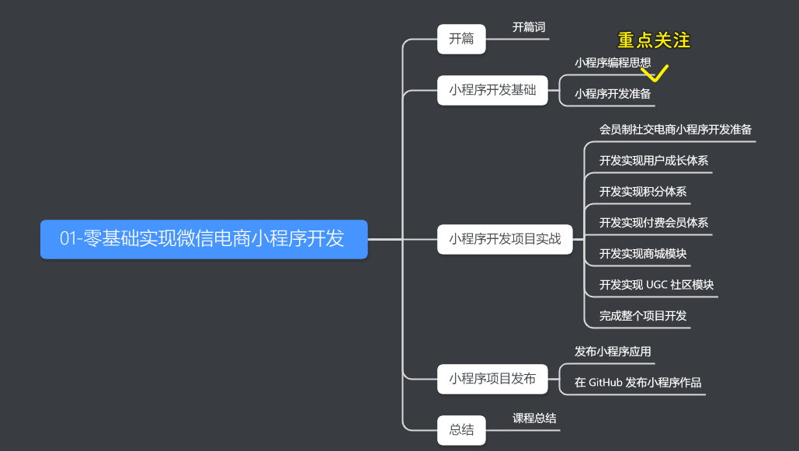

### ✍️ Tangxt ⏳ 2020-12-17 🏷️ 小程序基础

# 01-零基础实现微信电商小程序开发

> 教程：[零基础实现微信电商小程序开发-慕课专栏](https://www.imooc.com/read/40#new_header)

## ★收获？

* 掌握小程序编程思维与方法 — 分类拆解法
* 深入学习并掌握小程序开发的完整脉络
* 掌握商业小程序应用标配功能的开发技能
* 掌握商业项目开发过程并获取可商用完整源代码
* 成本低，无需自建服务器，一个 IDE 即可完成项目实战
* 实战项目作为小程序和 GitHub 面试作品，提升求职竞争力

> 我重点关注「分类拆解法」

## ★常见问题

1）如何提高编写代码的效率和质量？

换言之，如何拥有清晰的编程思路？

> 使用“编程思维与编程方法论 —— 分类拆解法”技能

“分类拆解法” 的核心思想就是将一个页面进行分类、拆解，厘清有多少个分类，以及分类之间的相互关系，然后编写代码逐一实现它们，最后把所有分类组合起来就实现了这个页面完整的功能。

2）这个专栏的实战项目？

> 商业项目 “会员制社交电商小程序”

这是一个类似 “小红书” 的商业小程序应用脱敏后的版本，包含会员成长与等级体系、积分体系、付费会员体系，以及商城、社区等每个商业小程序应用的标配功能。

专栏的讲解内容包含完整设计思路、功能实现、详细开发过程与可商用完整源代码。

3）整个专栏的模块划分？

专栏主要分为 5 个部分，12 模块，共 50 小节

专栏模块导图：<https://share.mubu.com/doc/6N-BRL-ZW8s>

## ★目录

- [01-开篇](./01.md)
