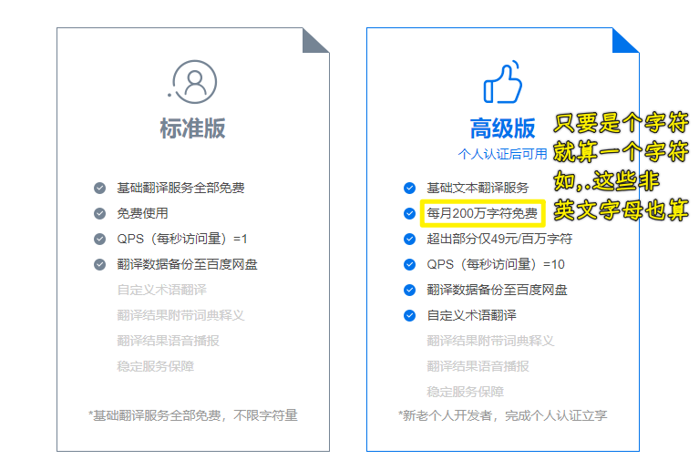
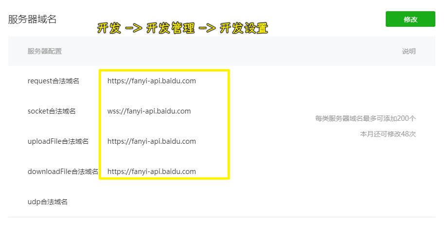
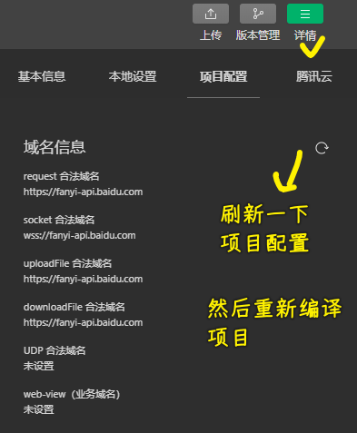

### ✍️ Tangxt ⏳ 2021-04-18 🏷️ 翻译工具

# 03-小程序开发翻译工具

1）翻译 API 

💡：百度翻译？

1. 登录翻译平台：<http://api.fanyi.baidu.com>
2. 注册成为开发者，获得 APPID
3. 进行开发者认证（如仅需标准版可跳过）
4. 开通通用翻译 API 服务：[开通链接](http://api.fanyi.baidu.com/api/trans/product/apichoose)
5. 参考技术文档和 Demo 编写代码

➹：[百度翻译开放平台](https://fanyi-api.baidu.com/product/113)

➹：[推荐一款好用的免费翻译API——百度翻译 - 知乎](https://zhuanlan.zhihu.com/p/81945858)

2）服务器域名配置

如果你不配置，那么你请求这个翻译接口：<https://fanyi-api.baidu.com/api/trans/vip/translate> 是会报错的！

配置完后，刷新项目配置，重新编译：

