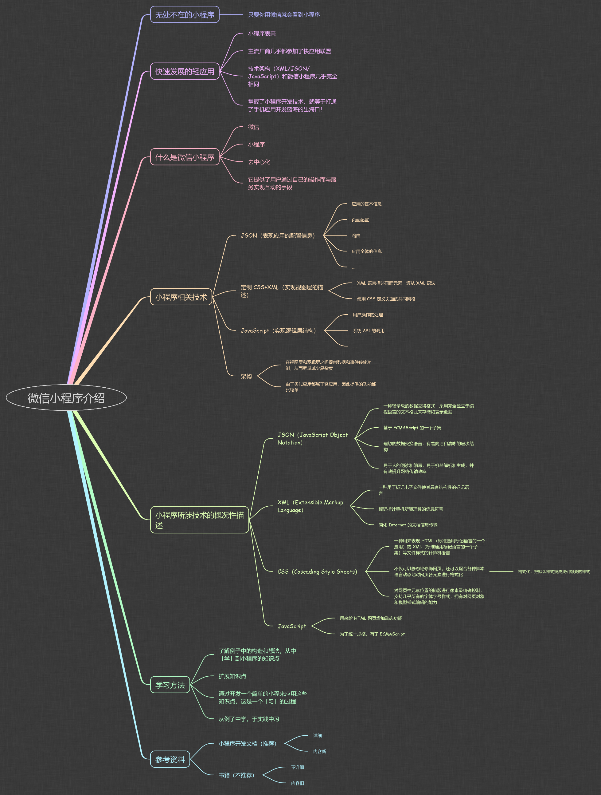
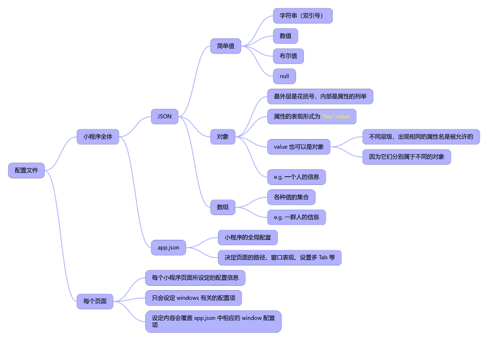
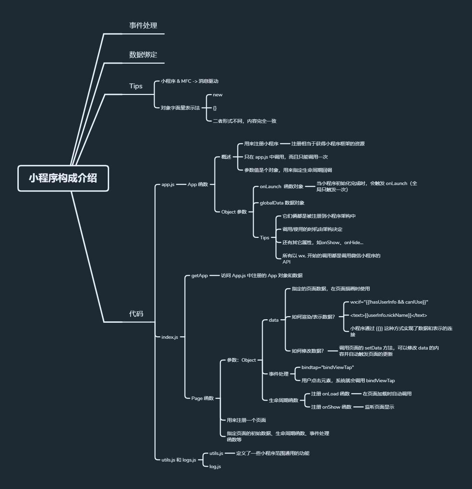

### ✍️ Tangxt ⏳ 2021-04-19 🏷️ 小程序

# 04-零基础入门微信小程序开发 (2020 版）

> 资料：[零基础入门微信小程序开发 (2020 版）_专栏](https://gitbook.cn/gitchat/column/5e465476dd0f044f5f2f961a)

## ★了解更多

对于一个图形界面的程序，大致可以分为 3 个层：

``` txt
+----------------------+
|   user application   |
+----------------------+
|     ui framework     |
+----------------------+
| operation system api |
+----------------------+
```

小程序的套路和 MFC 一样 -> 消息驱动

➹：[MFC编程特点与MFC类简介-阿里云开发者社区](https://developer.aliyun.com/article/416757)

➹：[MFC、WTL、WPF、wxWidgets、Qt、GTK 各有什么特点？ - 知乎](https://www.zhihu.com/question/23480014)

➹：[浅析微信小程序 App() 和 Page() 函数的内部实现 - ZUBIN BLOG](https://kangzubin.com/wxapp-App-Page-function/)

## ★微信小程序介绍



## ★小程序构成介绍

1）配置文件的形式和内容



2）WXML 和 WXSS


3）事件处理和数据绑定

