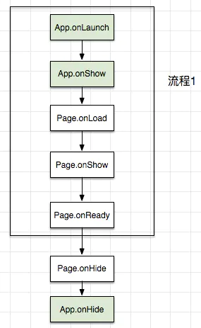
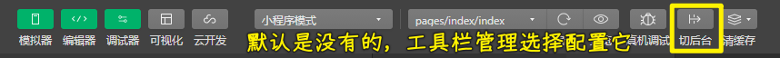
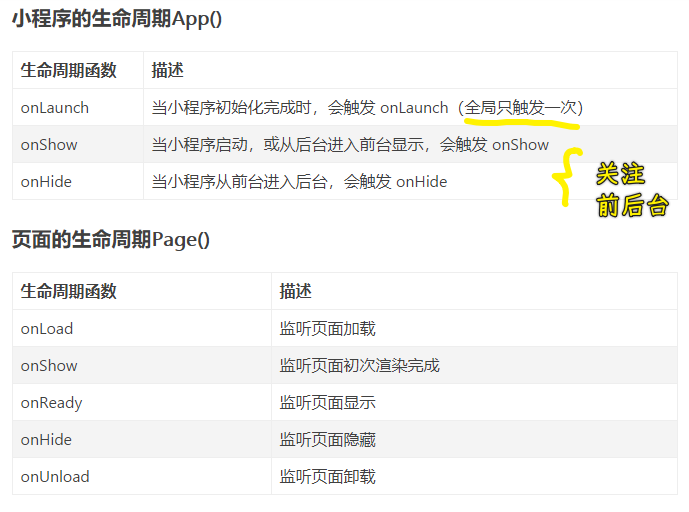
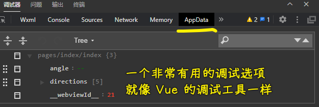

### ✍️ Tangxt ⏳ 2020-10-17 🏷️ faq

# FAQ

## 1、学习小程序的相关资料？

- [微信开放文档](https://developers.weixin.qq.com/miniprogram/dev/framework/)
- [TencentCloudBase/handbook: 小程序云开发技术训练营教程，即使是编程零基础也可以学。](https://cloudbase.net/community/guides/handbook/index.html)
- [justjavac/awesome-wechat-weapp: 微信小程序开发资源汇总 :100:](https://github.com/justjavac/awesome-wechat-weapp)

## 2、小程序实战？

- [TencentCloudBase/Good-practice-tutorial-recommended: 优秀实践教程推荐](https://github.com/TencentCloudBase/Good-practice-tutorial-recommended)

## 3、一个完整的小程序项目，其目录结构应该是怎样的？

为什么要关心这个目录结构？

> 关于小程序的目录结构，可以说一开始大家都有各自的开发习惯和命名规则，但一旦项目变得复杂庞大的时候，你就发现管理起来和后期维护变得很麻烦，如果是 **协同开发** 的话，更容易出现 **“互坑”** 的情况。

```
├─  app.js    --- 小程序加载时优先加载的入口 JS
├─  app.json   ---入口文件和公共配置
├─  app.wxss     ---公共样式表
├─  project.config.json     ---小程序全局配置文件
├─  sitemap.json     ---允许微信索引文件
│  
├─cloud-functions     ---云函数
│  └─setCrypto      ---数据加密模块，用户加密一些数据
│          index.js
│          package.json
│          ...
│          
├─components      ---小程序自定义组件
│  ├─plugins      --- （重点）可独立运行的大型模块，可以打包成 plugins
│  │  ├─comment         ---评论模块
│  │  │  │  index.js
│  │  │  │  index.json
│  │  │  │  index.wxml
│  │  │  │  index.wxss
│  │  │  │  services.js    ---（重点）用来处理和清洗数据的 service.js，配套模板和插件
│  │  │  │      
│  │  │  └─submit    ---评论模块子模块：提交评论
│  │  │          index.js
│  │  │          index.json
│  │  │          index.wxml
│  │  │          index.wxss
│  │  │      
│  │  └─canvasPoster     ---canvas 海报生成模块
│  │          index.js
│  │          index.json
│  │          index.wxml
│  │          index.wxss
│  │          services.js    ---（重点）用来处理和清洗数据的 service.js，配套模板和插件
│  │     ...
│  │          
│  └─templates   ---（重点）模板，通过外部传参的容器，不做过多的数据处理
│      │      
│      ├─slideshow     ---滚屏切换模板
│      │      index.js
│      │      index.json
│      │      index.wxml
│      │      index.wxss
│      │      service.js    ---（重点）用来处理和清洗数据的 service.js，配套模板和插件
│      │      
│      └─works       ---作品模板
│          │  index.js
│          │  index.json
│          │  index.wxml
│          │  index.wxss
│          │  service.js
│          │  
│          ├─articlePlugin    ---作品模板中的文章类型
│          │      index.js
│          │      index.json
│          │      index.wxml
│          │      index.wxss
│          │      
│          ├─galleryPlugin    ---作品模板中的九宫格类型
│          │      index.js
│          │      index.json
│          │      index.wxml
│          │      index.wxss
│          │      
│          └─videoPlugin     ---作品模板中的视频类型
│                  index.js
│                  index.json
│                  index.wxml
│                  index.wxss
│                  ...
│                  
├─config     ---自定义配置文件
│      config.js    ---存放基础配置
│      constants.js   ---存储常量
│      weui.wxss   ---第三方文件 wxss，js 等
│      ...
│      
├─pages     ---小程序页面
│  ├─user      ---用户页面
│  │      index.js
│  │      index.json
│  │      index.wxml
│  │      index.wxss
│  ├─news      ---新闻页面
│  │      index.js
│  │      index.json
│  │      index.wxml
│  │      index.wxss
│  │      
│  └─home      ---首页
│         index.js
│         index.json
│         index.wxml
│         index.wxss
│         ...   
│          
├─request      ---https 请求管理（根据 switch tab 分类会比较好）
│      common.js    ---一些公共请求获取，如兑换 openId,unionId 等
│      news.js
│      uri.js     --- （重点）总的 URI 请求管理，方便切换和配置 DEV,QA,PROD 环境
│      user.js
│      ...
│      
└─utils       ---功能组件
        logger.js    ---日志管理
        util.js       ---公共小组件库
        ...
```

➹：[填坑手册-小程序目录结构和组件化使用心得](https://juejin.im/post/6844903871135875079#comment)

## 4、场景值是啥？


场景值用来描述用户进入小程序的路径 -> 你是从哪儿来的？

➹：[场景值 - 微信开放文档](https://developers.weixin.qq.com/miniprogram/dev/framework/app-service/scene.html)

## 5、sitemapLocation 这个配置是用来干嘛的？

微信现已开放小程序内搜索，开发者可以通过 sitemap.json 配置，或者管理后台页面收录开关来配置其小程序页面是否允许微信索引。

当开发者允许微信索引时，微信会通过爬虫的形式，为小程序的页面内容建立索引。当用户的搜索词条触发该索引时，小程序的页面将可能展示在搜索结果中。

> 让用户可以搜索到你的内容！ -> 类似 robot.txt

➹：[微信小程序页面是否允许微信索引之 sitemap.json_Handada_fan 的博客-CSDN 博客](https://blog.csdn.net/qq_39441438/article/details/111906852)

➹：[sitemap 配置 - 微信开放文档](https://developers.weixin.qq.com/miniprogram/dev/reference/configuration/sitemap.html)

## 6、前后台切换？

涉及到生命周期 -> 你打开了一个小程序，突然一个电话来了，那么就从前台切换到后台了……

小程序进入后台的生命周期：



工具栏配置：



## 7、小程序的生命周期？

为啥要了解生命周期？ -> 因为这关系到什么时候加载数据、显示页面、缓存和恢复页面数据

小程序的生命周期包括两大部分：

- 小程序的生命周期 -> `App` -> 3 个钩子
- 页面的生命周期 -> `Page` -> 5 个钩子

这些钩子的描述：



注意某些场景下，这些钩子的调用顺序是怎样的……

如：

1. 首次启动小程序：`App.onLaunch --> App.onShow --> Page.onLoad --> Page.onShow --> Page.onReady`
2. 小程序进入后台（按 Home 键/左上角✘）：`1 --> Page.onHide --> App.onHide`
3. 小程序从后台重新打开：`2 --> App.onShow --> Page.onShow`
4. 按返回键：
   1. `1 --> Page.onUnload（非栈底页面）`
   2. `1 --> Page.onHide --> App.onHide（栈底页面）`
5. 从微信消息打开小程序（未安装小程序）：同`1`
6. 从微信消息打开小程序（已安装小程序且在后台运行）：同`3`
7. 从微信消息打开小程序（已安装小程序且不在后台运行）：同`1`
8. 小程序被销毁后重新启动（进入后台一段时间后被系统销毁）：同`1`

➹：[微信小程序生命周期 - 简书](https://www.jianshu.com/p/eeaee0c33424)

➹：[微信小程序的生命周期总结（附图）_Seven 的博客-CSDN 博客_微信小程序的生命周期](https://blog.csdn.net/qq_35546787/article/details/107955304)

➹：[监听小程序被完全销毁 - 微信开放社区](https://developers.weixin.qq.com/community/develop/doc/0000846a0d04306a0e27053f65a400)

## 8、调试选项：AppData




